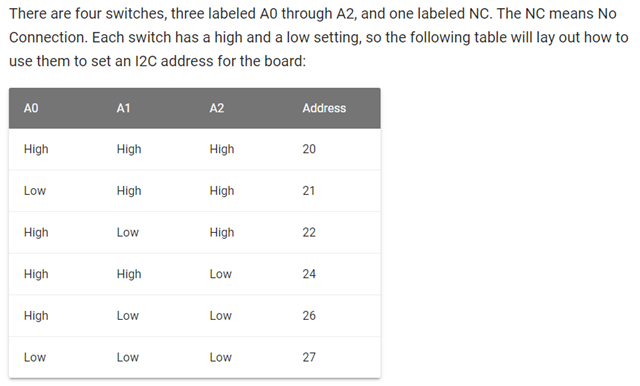

# Seeed Studio Relay Board (V2)

> **Note:** V2 implements the relay library as a class; I made this version for someone who wanted to use this library with a stack of relay boards, so I had to have the ability to initialize a specific board (and address) and control each separately. MEthod names and more changed with this version, so if you upgrade, you're going to have to change your code.

I had an idea for a project, a Raspberry Pi-based power controller for my media center. I searched around for relay boards, and discovered the [Seeed Studio Raspberry Pi Relay Board v1.0](https://www.seeedstudio.com/Raspberry-Pi-Relay-Board-v1.0-p-2409.html), so I thought I'd give it a try.

When I finally got around to playing with the hardware, I used (or should I say tried to use) Seeed Studio's [Wiki Page for the board](http://wiki.seeed.cc/Raspberry_Pi_Relay_Board_v1.0/) to guide my efforts. Unfortunately, I quickly learned that the article was incomplete and didn't have everything I needed to work with the board. I mounted the board on my Raspberry Pi, powered it up, ran their sample test application, and got nowhere. It didn't work.

I sent Seeed Studios an email asking for help and posted a couple of questions on their community forums, but had to wait more than a month to get a response. After another week of sending them screen shots, I finally got useful information and was able to get the board operational. The purpose of this GitHub repository is to share with you the code Seeed provides to test the board (so that you can grab it using `git` rather than copying and pasting it from a Wiki page) plus a Python module (and associated test application) you can leverage to use the relay board on the Raspberry Pi. the rest of the information, such as how to mount the board, set the switches, troubleshoot the board, and more is published here: [Using the Seeed Studio Raspberry Pi Relay Board](https://johnwargo.com/internet-of-things-iot/using-the-seeed-studio-raspberry-pi-relay-board.html). 

The steps for installing the board and verifying that it works includes the following steps:

1.	Mount the Relay board on the Raspberry Pi
2.	Enable the Raspbian I2C software interface
3.	Validate that the Raspberry Pi recognizes the board
4.	Run some Python code to exercise the board 

In the repository, you'll find three files:

+	`seeed_relay_test.py` - This is the sample application found on the [Seeed Studio Relay board Wiki page](http://wiki.seeed.cc/Raspberry_Pi_Relay_Board_v1.0/). When you run this application on your Pi (with the relay board connected, of course), you'll type commands in the terminal window to turn relays on and off. Refer to the Wiki page for details. 
+	`relay_lib_seeed.py` - A Python module that exposes several functions you can use in your own Python applications to control the relay board. The module is covered in the next section.
+	`relay_lib_seeed_test.py` - This is a sample Python application I wrote to exercise the module and validate that everything works.

## Using the Python Module

To use the module in your own Python applications, copy the module (`relay_lib_seeed.py`) into your project folder, then import the module in your Python application by adding the following line to the beginning of your application:

```python
from seeed_relay_v1 import Relay
```

Next, you must initialize the Relay object:

```python
relay = Relay()
```

This initializes the first board with a default address of `0x20`.  The board defaults to this address, but you can change the DIP switches on the board to set a different address. Settings for the DIP switches is published here: https://wiki.seeedstudio.com/Raspberry_Pi_Relay_Board_v1.0/ and https://johnwargo.com/internet-of-things-iot/using-the-seeed-studio-raspberry-pi-relay-board.html. 



If your first board is at a different address or to initialize a second board, use:

```
relay2 = Relay(0xSOMEOTHERADDRESS)
```

where `SOMEOTHERADDRESS` is the address of the board (set using DIP switches on the board) - like so:

```python
relay2 = Relay(0x21)
```

This exposes a series of functions to your application, you'll use them invoked through the `relay` object your created earlier:

- `on(int_value)` - Turns a single relay on. Pass an integer value between `1` and `4` (inclusive) to the function to specify the relay you wish to turn on. For example: `relay.on(1)` will turn the first relay (which is actually relay `0` internally) on.
- `off(int_value)` - Turns a single relay on. Pass an integer value between 1 and 4 (inclusive) to the function to specify the relay you wish to turn on. For example: `relay.on(4)` will turn the first relay (which is actually relay `3` internally) off.
- `all_on()` - Turns all of the relays on simultaneously.    
- `all_off()` - Turns all of the relays off simultaneously.
- `toggle_port` - Toggles the status of the specified relay. If it's on, the module will turn it off. If it's off, the module will turn it on. Cool, right?
- `get_port_status` - Returns a Boolean value indicating the status of the specified relay. `True` if the relay is on, `false` if the relay is off. This function was added to enable the capabilities of the `relay.toggle_port` function described previously.
- `get_port_data` - Returns an integer value representing the current state of the relay board. This function is used internally by `get_port_status`. The first four bits of the result indicate the status of the board's relays. From right to left, bit 0 represents relay 1, bit 1 represents relay 2, and so on, as shown in the following table. A zero in the bit position indicates that the relay is on.
- `print_status` - prints the status of all the relays as `Relay status: | 1: Off |  2: Off | 3: Off | 4: Off |`

Bit Values from `relay_get_port_data`

| Relay | Off       | On (binary) | On (Integer) |
|-------|-----------|-------------|--------------|
| 1     | 1111 1111 | 1111 1110   | 254          |
| 2     | 1111 1111 | 1111 1101   | 253          |
| 3     | 1111 1111 | 1111 1011   | 251          |
| 4     | 1111 1111 | 1111 0111   | 247          |

So, for example, to turn on port 1 on a particular relay board referenced by a `relay` object, you'd use the following:

```python
relay.on(1)
```

The repository has three test applications:

- `seeed_relay_test.py`:  This is the original relay board  code provided by Seeed Studios. If you can't get my library to work, I suggest you run this program to see if it works with Seeed's code. If it doesn't, talk to the folks at Seeed. If it does, and my library doesn't, feel free to open an issue [here](https://github.com/johnwargo/seeed-studio-relay-v2/issues) and I'll try to help.
- `relay_lib_seeed_test_1.py`:  This is a simple python program I wrote to test the original version of the library. It turns all the relays on, then all off, then cycles through all the relays one by one turning them on and off. 
- `relay_lib_seeed_test_2.py`:  This is an updated version of the test program I wrote to test V2 of the library; I describe how it works below. 

To see the module in action, open a terminal window on the Raspberry Pi, navigate to the folder where you extracted this repository's files, and execute the following command:

	python ./relay_lib_seeed_test_2.py

The application will:

+	Turn all of the relays on for a second
+	Turn all of the relays off for a second
+	Cycle through each of the relays (1 through 4) turning each on for a second using the library's `on` and `off` methods
+	Cycle through each of the relays (1 through 4) turning each on for a second using the library's `toggle_port` method

LEDs on the relay board (one for each relay) will illuminate when the relays come one. On my board, they weren't in sequence, so don't expect them to light in order.

That's it, that's all there is to it.

## Update History

06/18/2020 - Created this version.

***

If you find this code useful, and feel like thanking me for providing it, please consider making a purchase from [my Amazon Wish List](https://amzn.com/w/1WI6AAUKPT5P9). You can find information on many different topics on my [personal blog](http://www.johnwargo.com). Learn about all of my publications at [John Wargo Books](http://www.johnwargobooks.com).
